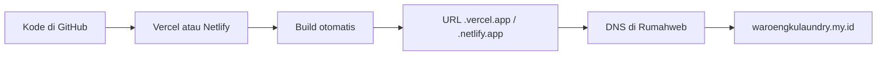

# Deploy gratis ke waroengkulaundry.my.id (Vercel / Netlify)

Panduan ini untuk **frontend toko** (`apps/web` — React + Vite). Domain Anda tetap di **Rumahweb**; yang gratis adalah **hosting file statis** di Vercel atau Netlify. Anda **tidak perlu** paket hosting web berbayar Rumahweb untuk langkah ini.

> **Catatan:** Backend API (`apps/api`) belum wajib untuk halaman toko. Nanti API bisa di-host terpisah (Railway, Render, dll.).

---

## Ringkasan alur



1. Push proyek ke **GitHub** (gratis).
2. Hubungkan repo ke **Vercel** atau **Netlify** → deploy otomatis.
3. Tambahkan domain custom di platform deploy.
4. Atur **DNS di Rumahweb** sesuai petunjuk platform.
5. Tunggu propagasi DNS (biasanya 5 menit–48 jam) → HTTPS aktif otomatis.

---

## Persiapan (sekali)

### 1. Build lokal (opsional, untuk cek)

```powershell
cd d:\Waroengkulaundry.my.id\apps\web
npm install
npm run build
```

Folder hasil: `apps/web/dist/` (berisi `index.html` + folder `assets/`).

### 2. Upload kode ke GitHub

Jika belum punya repo:

```powershell
cd d:\Waroengkulaundry.my.id
git init
git add .
git commit -m "Initial commit: Waroengku web"
```

Buat repo kosong di [github.com/new](https://github.com/new), lalu:

```powershell
git remote add origin https://github.com/USERNAME/waroengkulaundry.git
git branch -M main
git push -u origin main
```

Pastikan file `.env` **tidak** ikut commit (sudah ada di `.gitignore`).

---

## Opsi A — Vercel (disarankan, mudah untuk Vite)

### Langkah 1: Daftar & impor proyek

1. Buka [vercel.com](https://vercel.com) → login (bisa pakai akun GitHub).
2. **Add New…** → **Project**.
3. **Import** repositori GitHub Anda.
4. Di **Configure Project**, isi:

| Pengaturan | Nilai |
|------------|--------|
| **Framework Preset** | Vite |
| **Root Directory** | `apps/web` ← penting (monorepo) |
| **Build Command** | `npm run build` (default) |
| **Output Directory** | `dist` (default) |
| **Install Command** | `npm install` (default) |

5. Klik **Deploy**. Tunggu sampai status **Ready**.
6. Anda dapat URL sementara, misalnya `https://waroengku-web.vercel.app`.

### Langkah 2: Tambahkan domain di Vercel

1. Project → **Settings** → **Domains**.
2. Tambahkan:
   - `waroengkulaundry.my.id`
   - `www.waroengkulaundry.my.id` (opsional, disarankan)
3. Vercel menampilkan **DNS Records** yang harus Anda buat. **Salin persis** nilai dari dashboard (bisa berbeda per akun).

Contoh umum (verifikasi di dashboard Anda):

| Tipe | Host / Name | Value / Target |
|------|-------------|----------------|
| **A** | `@` | `76.76.21.21` |
| **CNAME** | `www` | `cname.vercel-dns.com` |

Untuk subdomain apex, Vercel kadang menyarankan nameserver Vercel — jika tidak ingin ganti NS, pilih opsi **A record** di dashboard.

### Langkah 3: Atur DNS di Rumahweb

1. Login [clientarea.rumahweb.com](https://clientarea.rumahweb.com) (atau panel domain Anda).
2. Buka domain **waroengkulaundry.my.id** → **DNS Management** / **Kelola DNS** / **Zone Editor**.
3. **Hapus atau edit** record lama yang bentrok (mis. A `@` mengarah ke IP hosting Rumahweb lama).
4. **Tambah record** sesuai tabel dari Vercel (Langkah 2).
5. Simpan.

**Jangan** ubah nameserver ke Vercel kecuali Anda sengaja ingin DNS sepenuhnya di Vercel.

### Langkah 4: Verifikasi

1. Di Vercel → **Domains**, status berubah menjadi **Valid** (bisa butuh waktu).
2. Buka **https://waroengkulaundry.my.id** di browser (mode penyamaran).
3. SSL (gembok hijau) biasanya otomatis dalam beberapa menit.

### Deploy ulang

Setiap `git push` ke branch `main`, Vercel build & deploy otomatis.

---

## Opsi B — Netlify

### Langkah 1: Daftar & impor proyek

1. Buka [netlify.com](https://www.netlify.com) → login (GitHub).
2. **Add new site** → **Import an existing project** → pilih repo.
3. Pengaturan build:

| Pengaturan | Nilai |
|------------|--------|
| **Base directory** | `apps/web` |
| **Build command** | `npm run build` |
| **Publish directory** | `apps/web/dist` |

4. **Deploy site**. Catat URL, mis. `https://random-name.netlify.app`.

File `apps/web/netlify.toml` di repo ini sudah mengatur redirect SPA jika nanti pakai routing URL.

### Langkah 2: Domain custom

1. **Site configuration** → **Domain management** → **Add a domain**.
2. Masukkan `waroengkulaundry.my.id` dan `www.waroengkulaundry.my.id`.
3. Netlify menampilkan DNS yang diperlukan — ikuti **nilai di dashboard** (bukan tebak-tebakan).

Contoh umum untuk apex:

| Tipe | Host | Value |
|------|------|--------|
| **A** | `@` | IP yang ditampilkan Netlify (load balancer) |
| **CNAME** | `www` | `nama-site-anda.netlify.app` |

Netlify juga menawarkan **Netlify DNS** (ganti nameserver) — opsional.

### Langkah 3: DNS di Rumahweb

Sama seperti Vercel: tambah/edit record di panel Rumahweb sesuai petunjuk Netlify.

### Langkah 4: HTTPS

Netlify → **Domain management** → **HTTPS** → sertifikat Let's Encrypt otomatis setelah DNS valid.

---

## Perbandingan singkat

| | Vercel | Netlify |
|---|--------|---------|
| Gratis untuk situs statis | Ya | Ya |
| HTTPS otomatis | Ya | Ya |
| Cocok untuk Vite/React | Sangat cocok | Cocok |
| Monorepo (`apps/web`) | Root Directory = `apps/web` | Base directory = `apps/web` |
| Deploy dari Git push | Ya | Ya |

Pilih **satu** saja agar DNS tidak bentrok (jangan arahkan domain ke Vercel dan Netlify sekaligus).

---

## Troubleshooting

### "Connection failed" / situs tidak buka

| Gejala | Penyebab | Solusi |
|--------|----------|--------|
| Domain tidak load | DNS belum propagasi | Tunggu 1–24 jam; cek [dnschecker.org](https://dnschecker.org) untuk `waroengkulaundry.my.id` |
| Halaman Rumahweb lama | A record masih ke IP hosting lama | Hapus A lama, pasang A/CNAME dari Vercel/Netlify |
| Deploy gagal | Root directory salah | Pastikan `apps/web`, bukan akar repo |
| 404 di subpath | Routing SPA | Sudah ada `vercel.json` / `netlify.toml` + `.htaccess` di `public/` |

### Build gagal di cloud

- Pastikan `package-lock.json` di `apps/web` ikut di Git.
- Lihat log build di dashboard Vercel/Netlify (tab **Deployments** / **Deploy log**).

### www vs tanpa www

Arahkan keduanya ke satu versi utama di pengaturan domain platform (**Redirect** `www` → apex atau sebaliknya).

---

## Setelah domain aktif

1. Buka situs → cek homepage, keranjang, checkout, tombol WhatsApp.
2. Info toko di `apps/web/src/config/site.ts` sudah memakai domain ini.
3. Untuk **API** nanti: subdomain `api.waroengkulaundry.my.id` + CNAME ke layanan backend; set `VITE_API_URL` di Environment Variables Vercel/Netlify.

---

## Checklist cepat

- [ ] Repo GitHub berisi proyek
- [ ] Deploy Vercel **atau** Netlify dengan root `apps/web`
- [ ] Domain ditambahkan di platform deploy
- [ ] Record DNS disalin ke Rumahweb (A + CNAME sesuai dashboard)
- [ ] Status domain **Valid** + HTTPS aktif
- [ ] Tes di HP & browser incognito

---

## File konfigurasi di repo

| File | Fungsi |
|------|--------|
| `apps/web/vercel.json` | Redirect SPA untuk Vercel |
| `apps/web/netlify.toml` | Build & redirect untuk Netlify |
| `apps/web/public/.htaccess` | Hanya jika upload manual ke Rumahweb/cPanel |

Panduan hosting Rumahweb (upload manual): [`DEPLOY-RUMAHWEB.md`](./DEPLOY-RUMAHWEB.md).
